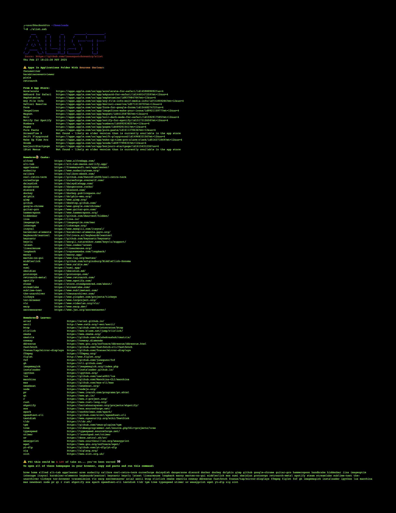

# alist
A script that lists out all of the apps installed on macOS from the app store, homebrew, and elsewhere...
___

Just copy and paste this into your terminal then press enter... go on, you can trust me😉


``` bash
# Define color and formatting codes
BOLD="\033[1m"
RED="\033[31m"
ORANGE="\033[38;5;208m"
RESET="\033[0m"

clear && printf "%s\n\n" "**************************************************************"
# Download the script
curl -s -o alist.zsh https://raw.githubusercontent.com/insasquatchcountry/alist/refs/heads/main/alist.zsh
if [ $? -ne 0 ]; then
    printf "${BOLD}${RED}ERROR: FAILED TO DOWNLOAD THE SCRIPT.${RESET}\n"
    return
fi

# Make the script executable
chmod u+x alist.zsh
if [ $? -ne 0 ]; then
    printf "${BOLD}${RED}ERROR: FAILED TO MAKE THE SCRIPT EXECUTABLE.${RESET}\n"
    return
fi

# Prompt for confirmation before running the script
printf "${BOLD}The script alist.zsh has been downloaded and is ready to run.${RESET}\n"
printf "\n"
printf "${ORANGE}            Do you wish to continue? (y/n): ${RESET}"
read confirmation
if [[ ! "$confirmation" =~ ^[Yy]$ ]]; then
    printf "\n"
    printf "Script execution canceled.\n"
    printf "\n"
    printf "%s\n" "**************************************************************"
    return
fi

printf "\n"
printf "%s\n" "**************************************************************"

# Run the script
./alist.zsh
if [ $? -ne 0 ]; then
    printf "${BOLD}${RED}ERROR: THE SCRIPT DID NOT EXECUTE SUCCESSFULLY.${RESET}\n"
    return
fi
```
___

## Script Breakdown
via GPT-4o mini

This script automates the process of downloading, preparing, and executing the `alist.zsh` script from a GitHub repository. It includes error handling and user prompts for a better user experience. Below is a detailed explanation of each section of the script.

### 1. Define Color and Formatting Codes

```bash
BOLD="\033[1m"
RED="\033[31m"
ORANGE="\033[38;5;208m"
RESET="\033[0m"
```

- **Purpose**: This section defines ANSI escape codes for text formatting.
  - `BOLD`: Makes text bold.
  - `RED`: Sets text color to red.
  - `ORANGE`: Sets text color to orange (using 256-color mode).
  - `RESET`: Resets text formatting to default.

### 2. Download the Script

```bash
curl -s -o alist.zsh https://raw.githubusercontent.com/insasquatchcountry/alist/refs/heads/main/alist.zsh
if [ $? -ne 0 ]; then
    printf "${BOLD}${RED}ERROR: FAILED TO DOWNLOAD THE SCRIPT.${RESET}\n"
    return
fi
```

- **Purpose**: This section downloads the `alist.zsh` script from the specified GitHub URL.
  - `curl -s -o alist.zsh`: Uses `curl` to silently download the file and save it as `alist.zsh`.
  - The `if` statement checks if the previous command was successful. If not, it prints an error message in bold red and returns from the script.

### 3. Make the Script Executable

```bash
chmod u+x alist.zsh
if [ $? -ne 0 ]; then
    printf "${BOLD}${RED}ERROR: FAILED TO MAKE THE SCRIPT EXECUTABLE.${RESET}\n"
    return
fi
```

- **Purpose**: This section changes the permissions of the downloaded script to make it executable.
  - `chmod u+x alist.zsh`: Adds execute permission for the user (owner) of the file.
  - The `if` statement checks if the command was successful. If not, it prints an error message in bold red and returns from the script.

### 4. Prompt for Confirmation Before Running the Script

```bash
printf "${BOLD}The script alist.zsh has been downloaded and is ready to run.${RESET}\n"
printf "${ORANGE}Do you want to continue? (y/n): ${RESET}"
read confirmation
if [[ ! "$confirmation" =~ ^[Yy]$ ]]; then
    printf "Script execution canceled.\n"
    return
fi
```

- **Purpose**: This section informs the user that the script is ready to run and prompts for confirmation.
  - The first `printf` statement displays a message in bold indicating that the script is ready.
  - The second `printf` statement prompts the user in orange to confirm whether they want to continue.
  - The `read` command captures the user's input.
  - The `if` statement checks if the input is not "y" or "Y". If the user chooses not to continue, it prints a cancellation message and returns from the script.

### 5. Run the Script

```bash
./alist.zsh
if [ $? -ne 0 ]; then
    printf "${BOLD}${RED}ERROR: THE SCRIPT DID NOT EXECUTE SUCCESSFULLY.${RESET}\n"
    return
fi
```

- **Purpose**: This section executes the downloaded script.
  - `./alist.zsh`: Runs the script.
  - The `if` statement checks if the execution was successful. If not, it prints an error message in bold red and returns from the script.

---

### Summary

This script provides a user-friendly way to download, prepare, and execute the `alist.zsh` script while incorporating error handling and user confirmation. The use of color formatting enhances the visibility of important messages, making it easier for users to understand the script's status and any issues that may arise.

# Sample Output
(see .pdf for clickable links etc.)




